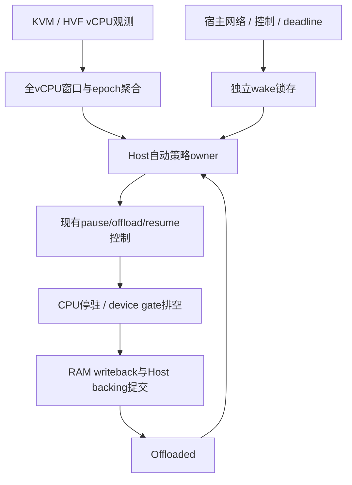
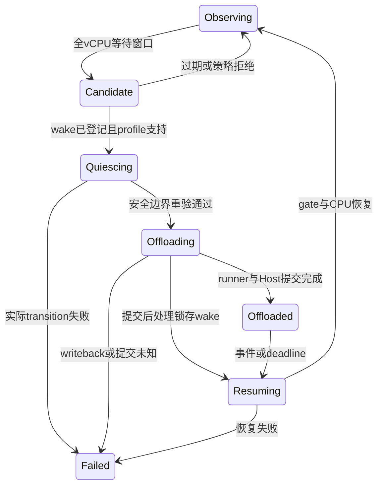

# EXP-001 设计：Host-driven idle offload

## 1. 目标与非目标

不修改Agent与guest内核，从pVisor vCPU和宿主事件侧发现等待窗口，自动卸载RAM并在需要执行时恢复。观测回答“何时值得卸载”；现有CPU/device quiescence和backing commit回答“如何安全卸载”。

不证明所有Linux进程阻塞，不做通用checkpoint/migration，不冻结guest时间，不支持任意设备或所有内存机制叠加，不承诺生产密度倍率。

## 2. 后端观测

| 后端 | 现有接点 | 拟议方案 | 限制 |
|---|---|---|---|
| HVF | `vmm/macos/vstate.rs`的WaitForEvent/Timeout及等待channel；`hvf/mod.rs`读取虚拟timer | 等待进入/离开序列、可用deadline，独立owner聚合全部vCPU | WFE可能是同步等待；需验证其它timer/IRQ来源，不能只凭一个寄存器声称完整 |
| KVM | vCPU线程与`vmm/linux/vstate.rs`运行循环 | 先观察CPU时间/调度等候选窗口；核验可选KVM宿主事件来源 | KVM_RUN未返回可能正在执行；低CPU也可能宿主抢占；当前Hlt分支是Stopped，禁止直接改语义 |

KVM tracepoint/eBPF或用户态halt处理只是候选路线，具体内核接口、权限、开销与兼容性未核验。第一阶段不改irqchip、不要求全局sysctl或特权追踪。无法可靠区分时标Unknown并拒绝自动操作。

M0 已定义观测状态：Executing、HandlingExit、WaitingForEvent、HostDescheduled、ManualPaused、Stopped、Unknown。只有全online vCPU等待且满足策略时产生候选。禁止把HostDescheduled归为guest idle；等待状态是机会，不是Linux runqueue真值。

## 3. 职责与接入

- `pvisor-vm`归属后端观测及CPU/device控制，新增公共契约必须集中于`api.rs`，不为实验暴露私有VMM模块。
- `pvisor`归属策略、Host backing commit、Attempt生命周期、配置和可解释事件。
- OverlayNet等事件源在guest RAM访问或可能阻塞的channel之前通知wake。
- 单一control owner串行仲裁自动策略与手动pause/resume/checkpoint/cancel，不另造completion owner。

观测状态、快照与 `VcpuObservationControl` 已在 `api.rs` 实现，详见 [验证记录](validation.md)。本文 Host 自动策略 owner、wake/deadline 与自动 offload 状态机仍为设计，尚未实现。

## 4. Wake与deadline

至少需要Attempt身份、CPU topology generation、观测sequence、idle epoch、pending wake sequence、停驻原因、可用deadline和clock domain。

wake在Candidate/Quiescing/Offloading/Offloaded阶段均latch；已有pending事件不得忽略。进入停止边界后重验观测和事件sequence。Host backing提交期间收到wake先排队，提交完成后立即恢复，不能提前打开writers。

网络数据、EOF、错误、连接完成优先作为语义wake，不用socket writable/普通ACK无条件触发。wake先于virtqueue/memory gate访问，由独立owner处理，设备线程不得持queue/proxy锁同步resume。恢复后重查挂起事件/ring，不仅依赖新EPOLLET边沿。

最早有效timer deadline需要覆盖目标profile，明确guest/host时间转换与提前恢复margin；未知或太短就跳过。watchdog只能作为PoC容错，不能代替精确timer支持。当前pause保留wall-time，不通过冻结时间隐藏过期timer。

## 5. 状态与失败

busy/unsupported/short-window是破坏性transition之前的正常拒绝。现有drain超时会fail_control，不能把poisoned runner当普通拒绝后继续执行。正常取消一个已开始的transition必须证明状态恢复，不能直接跳回Observing。

自动wake只解除该owner/epoch的自动停驻；人工pause、snapshot freeze、failed状态保持原语义。guest不能伪造Host权限或绕过资源限额。观察误判主要影响性能，但丢wake、timer缺失或绕过commit会破坏执行正确性。

## 6. 初期profile

- 普通writable shared file-backed RAM、raw offload、同live Attempt。
- 先单vCPU，SMP聚合/epoch验收后扩展。
- 网络wake优先现有OverlayNet IPv4 TCP；明确timer与控制wake支持。
- 无在途virtio-fs请求；慢I/O跳过，不对已有RAM lease强行discard。
- 排除cold pager/pool、restored private COW、未守护设备、未知wake来源。
- 后端deadline/wake未验收时，保持observe-only；不因HVF接点更明确就宣传macOS全平台已支持。

## 7. 策略与收益

先固定可解释的grace、deadline guard、最低再停驻间隔和thrash抑制，再探索pressure-aware策略。参数由实验决定，不从单次手动offload数据设置生产默认。

主要目标是内存时间积分下降，同时满足任务QoS；包括完整cgroup/PSS/cache/helper、CPU/IO、峰值、恢复延迟、吞吐、失败和有效结果。短阻塞只CPU休眠，长窗口才回收RAM，更长停驻再研究压缩backing。

先证明host-only观测足够有用；guest PV可选增强留待后续，不因追求“精确全部进程状态”无限扩大首版范围。
